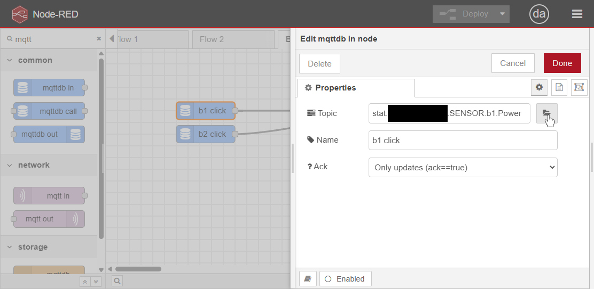
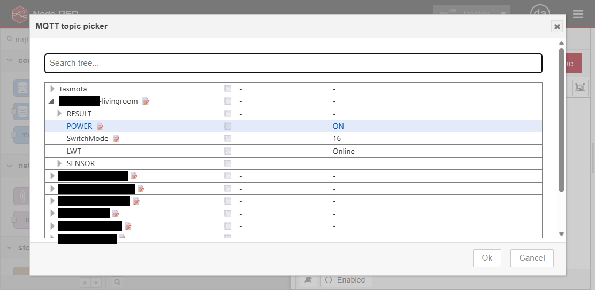
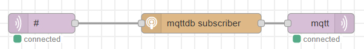

# node-red-contrib-mqtt-picker

MQTT nodes for Node-RED with a topic picker in the UI.
All MQTT messages are effectively retained in a local JSON file.





The database uses normalized, prefixless topic names. One leading `stat/`,
`tele/`, or `cmnd/` is removed from incoming MQTT messages, so topics such as
`stat/device/POWER` and `tele/device/SENSOR` are exposed as `device.POWER` and
`device.SENSOR`. The topic picker displays that normalized database directly.

Outgoing topics are slash-separated. When `device.INFO1.Version` is a string
containing `tasmota` (case-insensitively), an outgoing topic such as
`device.POWER` is published as `cmnd/device/POWER`. Other devices publish the
prefixless `device/POWER` topic. Traffic in the exact
`tasmota/discovery/#` namespace is ignored and is not stored or streamed.

There's no MQTT library bundled. In fact, there's zero dependencies.
MQTT messages need to be fed in/out from external sources into
a special mqttdb subscriber node.



## Test run

To start a node-red instance on 127.0.0.1:1880:

```sh
npm install
npm run dev
```

## HTTP API

The MQTT database is available as a read-only runtime endpoint at
`/mqtt-db/data`, relative to `httpNodeRoot`. This endpoint is separate from the
editor endpoint with the same path. It uses Node-RED's standard `httpNodeAuth`
authentication.

Configure separate admin and runtime roots and HTTP node authentication in the
Node-RED `settings.js`:

```js
httpAdminRoot: "/admin",
httpNodeRoot: "/api",
httpNodeAuth: {
  user: "mqtt-site",
  pass: "<bcrypt hash from node-red admin hash-pw>",
},
```

Generate the password hash with Node-RED:

```sh
node-red admin hash-pw
```

The endpoint is then available at `/api/mqtt-db/data`:

```sh
curl --user mqtt-site:password \
  https://node-red.example.com/api/mqtt-db/data
```

Subscribe to multiple topics with `POST /mqtt-db/subscribe`. The response stays
open and streams each matching update as newline-delimited JSON (NDJSON):

```sh
curl -N --user mqtt-site:password \
  -H 'Content-Type: application/json' \
  --data '{"topics":["device.SENSOR","device.POWER"]}' \
  https://node-red.example.com/api/mqtt-db/subscribe
```

Each output line has the update's `topic`, `value`, and `acked` state:

```json
{"topic":"device.POWER","value":"ON","acked":true}
{"topic":"device.SENSOR.Temperature","value":21.5,"acked":true}
```

The request body may also be a JSON array of topic strings. Duplicate topics
are subscribed only once. The subscriptions are removed when the HTTP client
disconnects.

`httpNodeAuth` protects every endpoint below `httpNodeRoot`, not just this one.
Use HTTPS. For a public website, keep the credentials on the website backend and
proxy authenticated requests to Node-RED.

The editor GET and POST endpoints remain under `httpAdminRoot` and require the
Node-RED permissions `mqtt-db.read` and `mqtt-db.write` when `adminAuth` is
enabled.
